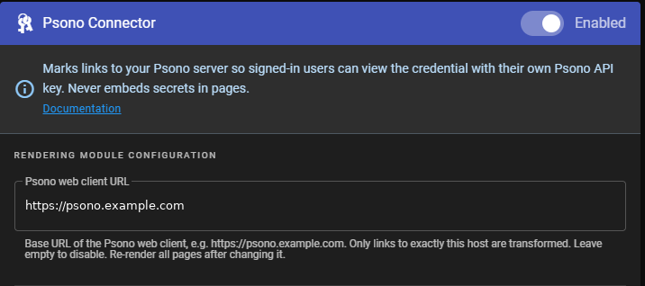

# Installation

<!-- SPDX-License-Identifier: AGPL-3.0-only -->

> [!CAUTION]
> **HTTPS IS REQUIRED.** Run Wiki.js, the connector and Psono **only over HTTPS**
> (Wiki.js *Administration → General → Site URL* must start with `https://`).
> Over plain HTTP, users' Psono API keys, passwords, one-time codes and the
> Wiki.js session cookie travel **in clear text** and can be intercepted by
> anyone on the network path. The sidecar refuses `http://` URLs unless
> `PSONO_CONNECTOR_ALLOW_HTTP=true`, which exists **for local development only**;
> the browser UI shows a red warning whenever a page is not served over HTTPS.

You install three things. **None of them modifies Wiki.js.**

| Part | Where it runs | How |
|---|---|---|
| Rendering module `html-psono-connector` | inside the Wiki.js container | read-only bind mount |
| Sidecar service (+ its own PostgreSQL) | next to Wiki.js, as containers | Docker Compose |
| One routing rule for `/psono-connector/` | your reverse proxy | see [reverse-proxy.md](deployment/reverse-proxy.md) |

Read the [disclaimer](../README.md#disclaimer--read-this-before-you-use-it) and check the
[tested versions](compatibility.md) first.

**Before you start**, have: Wiki.js 2.x reachable over HTTPS through a reverse
proxy, a Psono server (HTTPS), and Docker with Compose v2 on the host that runs
Wiki.js. About 20 minutes.

## Step 1 — Create secrets and configuration

```sh
git clone https://github.com/IspiroDevelopers/wikijs-psono-connector
cd wikijs-psono-connector/deploy
sh ../scripts/init-secrets.sh .
```

This creates `master.key`, `.db-secret`, `database.url` (mode 600) and
`connector.env` from [`connector.env.example`](../deploy/connector.env.example).
It never overwrites existing files. **Back up `master.key` offline.**

Edit `connector.env`:

| Setting | Value |
|---|---|
| `PSONO_CONNECTOR_PUBLIC_URL` | the wiki address exactly as users type it, e.g. `https://wiki.example.com` |
| `PSONO_WEB_BASE_URL` | your Psono web client, e.g. `https://psono.example.com` |
| `PSONO_API_BASE_URL` | your Psono API, usually `https://psono.example.com/server` |
| `WIKIJS_INTERNAL_URL` | how the sidecar reaches Wiki.js, e.g. `http://wikijs:3000` (service name + port) |
| `PSONO_SERVER_VERIFY_KEY` | the Psono server pin — next step |

**Get and verify the Psono server pin.** The pin makes the connector refuse to
talk to a server that is not the real Psono ([ADR-0009](adr/0009-psono-server-pinning.md)).

```sh
docker run --rm -e PSONO_API_BASE_URL=https://psono.example.com/server \
  ghcr.io/ispirodevelopers/wikijs-psono-connector:latest node main.cjs print-server-pin
```

The command trusts the server on first use, so **compare the printed value**
with the *server signature* shown in Psono (Other → API keys → create or open a
key) or ask your Psono administrator. Then paste it into `connector.env`.

Set `WIKIJS_NETWORK` if your Wiki.js Docker network is not `wikijs_default`
(`docker network ls`; export it or put it in a `.env` next to the compose file).

## Step 2 — Start the sidecar

```sh
docker compose up -d
docker compose logs psono-connector | tail
```

You should see `Wiki.js Psono Connector sidecar started`. A bad setting stops
the sidecar with a message naming the variable.

## Step 3 — Install the module into Wiki.js

```sh
docker compose run --rm --no-deps --user "$(id -u):$(id -g)" \
  -v "$PWD/modules:/out" psono-connector node main.cjs install-module /out
```

This writes `./modules/html-psono-connector`. In the compose file of **your
Wiki.js**, add to the Wiki.js service's `volumes:` (use the real path to that
folder):

```yaml
      - /path/to/wikijs-psono-connector/deploy/modules/html-psono-connector:/wiki/server/modules/rendering/html-psono-connector:ro
```

Recreate Wiki.js (`docker compose up -d wiki`); its log shows
`Loaded 1 new renderers: [ OK ]`. The folder name **must** be
`html-psono-connector`.

> Do not mount a directory that a build process deletes and recreates: a bind
> mount keeps pointing at the deleted one.

## Step 4 — Add the reverse proxy rule

Route `/psono-connector/` **unchanged** to the sidecar (port 3100) and leave
everything else going to Wiki.js. Copy-paste snippets for nginx (same host or
another machine), Caddy, Traefik and Apache — and the four `curl` checks — are
in **[deployment/reverse-proxy.md](deployment/reverse-proxy.md)**. Starting
points: [`deploy/nginx-location.conf.example`](../deploy/nginx-location.conf.example),
[`deploy/Caddyfile.example`](../deploy/Caddyfile.example).

## Step 5 — Check

```sh
docker compose exec psono-connector node main.cjs doctor
```

`doctor` verifies the configuration, HTTPS, the database, Wiki.js, the Psono
server identity and (when reachable) the proxy rule, and says what to fix.

## Step 6 — Configure Wiki.js (Administration area)

1. **Rendering → HTML → Psono Connector**: enable it, set *Psono web client URL*
   (same as `PSONO_WEB_BASE_URL`), **Apply**.

   

   *(Development screenshot; in production use an `https://` address.)*

2. **Theme → Code Injection → Body HTML Injection**: add

   ```html
   <script src="/psono-connector/client.js" defer></script>
   ```

   and **Apply**.
3. **Utilities → Content → Rerender All Pages** — once now, and again whenever
   you change the Psono URL. Pages saved later render automatically.
4. Optional — **Navigation**: add a link *My Psono API key* →
   `/psono-connector/settings`.
5. Work through the [production checklist](deployment/production-checklist.md).

## Step 7 — Try it

Create a page with a link copied from Psono (*entry → Show advanced → Entry
link*). A signed-in reader sees a card; the first time, it offers *Configure
Psono*. What users do is described in the [user guide](user-guide.md).

## Upgrading

- **Wiki.js**: upgrade as usual. The module mount and the script tag survive.
  If a Wiki.js release changes the rendering pipeline, the project's
  compatibility checks (`npm run test:compat`) catch it.
- **Connector**: `docker compose pull && docker compose up -d`, then repeat
  step 3 to refresh the module and recreate Wiki.js. Database migrations run
  automatically; the sidecar refuses to start against a newer schema than it
  knows (no silent downgrade). Read the [changelog](../CHANGELOG.md) first.

## Uninstalling

1. Remove the script tag from Theme → Code Injection and disable the renderer;
   rerender pages.
2. Remove the module mount and the proxy rule; `docker compose down`.
3. Optionally delete the `connector-db-data` volume. Without `master.key` the
   stored API keys are unreadable anyway.

Something not working? → [troubleshooting](troubleshooting.md).
