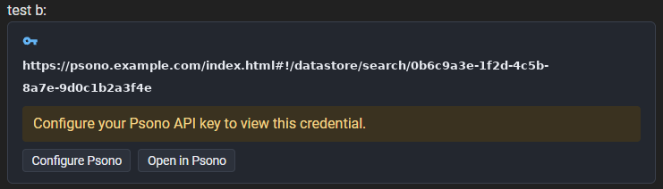
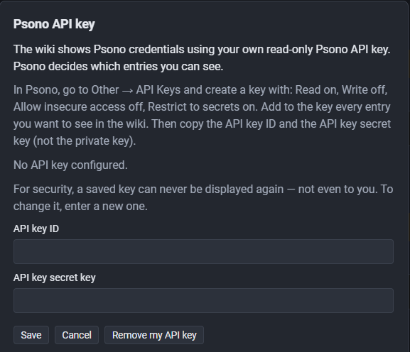
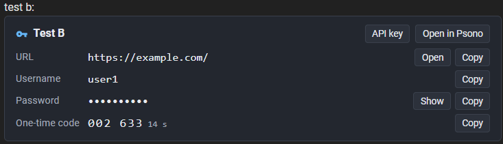

# User guide

<!-- SPDX-License-Identifier: AGPL-3.0-only -->

For people who **read** wiki pages with Psono links. (Administrators: see the
[installation guide](installation.md).)

## What you see

A link to a Psono entry in a wiki page becomes a card with the entry's title, URL,
username, notes, and — only when you ask — the password and one-time code. You see
exactly what **your own** Psono account may see; the wiki never has more access
than you do.

> The connector only works over **HTTPS**. If you see a big red warning about an
> insecure connection, do not enter your key and tell your administrator.

## One-time setup: your Psono API key

The first card asks you to *Configure Psono*:

You need an **API key** from Psono:

1. In Psono go to **Other → API keys → New API key** and create one with:
   - **Read**: on
   - **Write**: **off**
   - **Allow insecure access**: **off**
   - **Restrict to secrets**: on
2. **Add to the key every entry you want to see in the wiki.** Psono only lets a
   key read entries explicitly added to it. If you open a card and it says the
   entry "is not available with your Psono API key", this is usually why.
3. Copy the **API key ID** and the **API key secret key** (not the *private key*).
4. In the wiki card, click *Configure Psono*, paste both values, *Save*.

   

   Afterwards the card shows the entry, and you reveal the password or the one-time
   code only when you need them:

   

   *(Screenshots are from a development setup and a slightly earlier build; wording may differ a little.)*

Good to know:

- **Per browser.** The key works in the browser where you entered it and expires
  after **30 days** at most; then enter it again. Another browser or device needs
  its own enrollment.
- **Write-only.** Once saved, nobody can display the key again — not you, not an
  administrator. To change it, enter a new one.
- **Remove it any time.** The *API key* button on every card (and
  `/psono-connector/settings`) offers *Remove from this browser* and *Remove from
  all my browsers* (lost laptop?). Removing works even if Psono is down or the key
  was revoked.
- Do not let your password manager save the key fields; saving it there would make
  it readable again.

## Using a card

| Action | What happens |
|---|---|
| *Show* (password) | fetched on click, hidden and wiped after 30 s or on *Hide* |
| *Show* (one-time code) | same; while shown it refreshes itself every period |
| *Copy* | copies the value; works without showing it |
| *Open* | opens the entry's URL |
| *Open in Psono* | opens the entry in the Psono web client |

Anything the connector cannot show (SSH keys, credit cards, …) is only openable in Psono.

## Security rules of thumb

- Link **entries**, never Psono *link shares*: those URLs contain the decryption
  key and are never turned into cards.
- A copied password stays in your clipboard; clear it when you are done.
- If a card ever shows **"⚠ SECURITY WARNING: the identity of the Psono server has
  changed"**, stop and contact your administrator.
